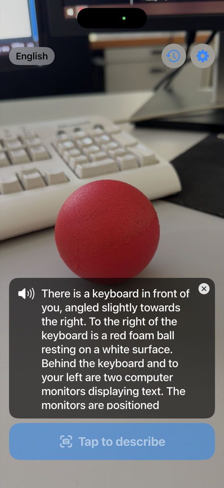
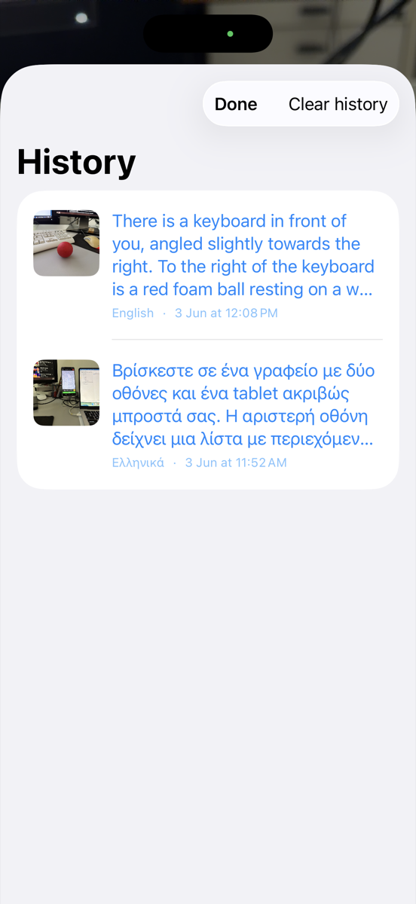
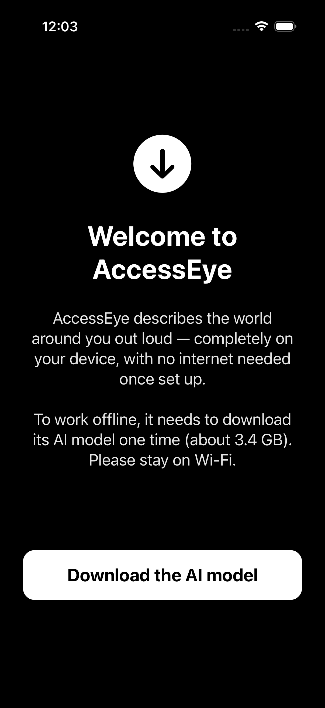
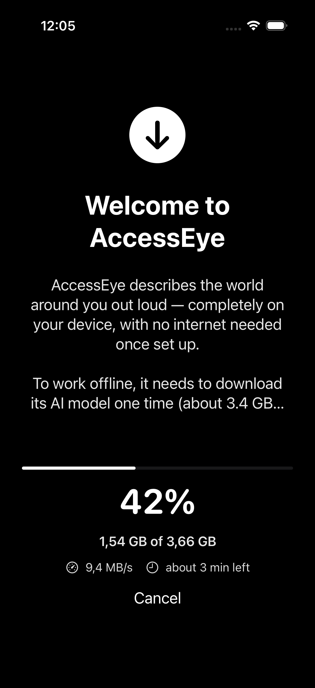
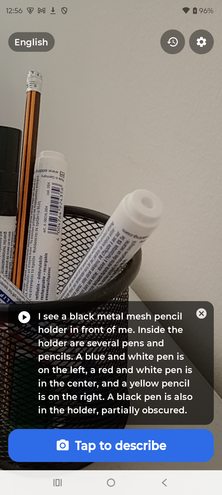
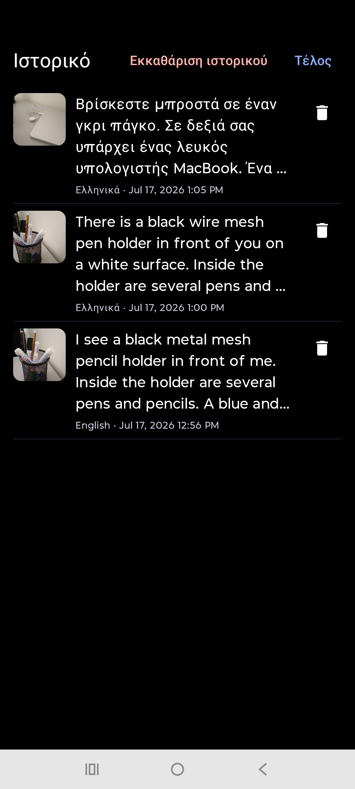

# AccessEye


-purple)


[Read in English](README.md)

Ένας offline αφηγητής με τεχνητή νοημοσύνη για τυφλούς χρήστες και χρήστες με
μειωμένη όραση, για iPhone και Android. Στρέφετε το κινητό προς τον κόσμο,
αγγίζετε την οθόνη, και σας περιγράφει φωναχτά τι υπάρχει μπροστά σας, στη
γλώσσα σας. Όλα τρέχουν στη συσκευή. Χωρίς internet, χωρίς λογαριασμό, χωρίς
cloud, χωρίς συνδρομή.

Έφτιαξα το AccessEye επειδή τα περισσότερα εργαλεία που «περιγράφουν τον κόσμο»
εξαρτώνται από έναν server, έναν λογαριασμό και σύνδεση δεδομένων. Αυτό δεν
βοηθάει αν είστε offline, αν ταξιδεύετε, ή αν απλώς δεν θέλετε η εικόνα της
κάμεράς σας να φεύγει από το κινητό σας. Τα σύγχρονα κινητά είναι αρκετά
γρήγορα ώστε να τρέχουν ένα πραγματικό πολυτροπικό μοντέλο τοπικά, και το
AccessEye κάνει ακριβώς αυτό.

## Στιγμιότυπα οθόνης

<p align="center">
  
  &nbsp;&nbsp;
  
</p>

<p align="center">
  
  &nbsp;&nbsp;
  
</p>

<p align="center"><em>Στρέφετε και αγγίζετε, και η σκηνή περιγράφεται και εκφωνείται.
Κάθε περιγραφή αποθηκεύεται μαζί με τη φωτογραφία της. Το μοντέλο κατεβαίνει μία
φορά, και μετά όλα δουλεύουν offline.</em></p>

Η ίδια εφαρμογή σε Android (Kotlin + Jetpack Compose, ίδιο αρχείο μοντέλου,
ίδιες γλώσσες):

<p align="center">
  
  &nbsp;&nbsp;
  
</p>

## Τι κάνει

- Στρέφετε και αγγίζετε. Ολόκληρη η οθόνη είναι το κουμπί λήψης, αγγίζετε
  οπουδήποτε για να τραβήξετε φωτογραφία.
- Κατανόηση στη συσκευή. Το μοντέλο όρασης Gemma 3n της Google τρέχει τοπικά
  στη Metal GPU και περιγράφει τη σκηνή για έναν τυφλό χρήστη.
- Το εκφωνεί δυνατά. Η περιγραφή διαβάζεται με το text-to-speech του
  συστήματος, στη γλώσσα που έχετε επιλέξει, και ακούγεται ακόμα κι όταν το
  κινητό είναι στο αθόρυβο.
- Πολύγλωσσο. Αγγλικά, ελληνικά, ισπανικά, γαλλικά, γερμανικά, αραβικά, χίντι,
  ιταλικά και ρωσικά. Ένα μοντέλο αναλαμβάνει και την περιγραφή και τη
  μετάφραση.
- Ιστορικό με φωτογραφίες. Κάθε περιγραφή αποθηκεύεται με τη φωτογραφία της.
  Αγγίζετε για να την ξανακούσετε, σύρετε για διαγραφή.
- Προτεραιότητα στην προσβασιμότητα. Πλήρης υποστήριξη VoiceOver, τεράστια
  περιοχή αφής, δονήσεις (haptics), μεγάλα γράμματα υψηλής αντίθεσης και
  φωνητική ανατροφοδότηση σε κάθε ενέργεια.
- Ιδιωτικό. Η εικόνα δεν φεύγει ποτέ από το κινητό. Η μόνη χρήση δικτύου σε
  όλη την εφαρμογή είναι η εφάπαξ λήψη του μοντέλου.

## Πώς λειτουργεί

```
 Camera frame  ->  Gemma 3n (on-device, Metal GPU)  ->  Text-to-Speech
 (AVFoundation)    "describe this for a blind user      (AVSpeechSynthesizer,
                    in Greek"                            your language, offline)
```

Το Gemma 3n είναι ταυτόχρονα πολυτροπικό (βλέπει εικόνες) και πολύγλωσσο,
οπότε ένα και μόνο μοντέλο στη συσκευή κάνει την περιγραφή της σκηνής και τη
μετάφραση σε ένα βήμα. Δεν υπάρχει ξεχωριστή υπηρεσία μετάφρασης. Η αλλαγή
γλώσσας αλλάζει μόνο το prompt και τη φωνή εκφώνησης.

Η εφαρμογή είναι μικρή (περίπου 40 MB). Στην πρώτη εκκίνηση κατεβάζει το
μοντέλο μία φορά (περίπου 3,4 GB) με μπάρα προόδου, και μετά δουλεύει πλήρως
offline. Μπορείτε να διαγράψετε και να ξανακατεβάσετε το μοντέλο όποτε θέλετε
από τις Ρυθμίσεις.

## Τεχνολογίες

- UI: SwiftUI (iOS 26)
- Μοντέλο: Gemma 3n E2B (int4), μορφή .litertlm
- Inference: LiteRT-LM (Google AI Edge) με επιτάχυνση Metal GPU
- Κάμερα: AVFoundation
- Ομιλία: AVSpeechSynthesizer (ενσωματωμένος στο iOS, offline)
- Χωρίς analytics τρίτων, χωρίς λογαριασμούς, χωρίς backend.

### Δομή του project

Το repo είναι οργανωμένο ανά πλατφόρμα. Οι δύο εφαρμογές μοιράζονται την ίδια
ιδέα, το ίδιο αρχείο μοντέλου και τις ίδιες γλώσσες: κάμερα, μετά Gemma στη
συσκευή μέσω LiteRT-LM, μετά text-to-speech.

```
ios/                       the iOS app (SwiftUI)
  AccessEye.xcodeproj
  AccessEye/
    AccessEyeApp.swift     entry point -> RootView
    AppViewModel.swift     state machine: prepare -> ready -> describe -> speak
    AI/                    model config, LiteRT-LM service, download manager
    Camera/                AVFoundation capture + SwiftUI preview
    Speech/                text-to-speech wrapper
    History/               saved descriptions + photos
    Models/                supported languages
    Support/               haptics, localized strings
    Views/                 onboarding, camera screen, settings, history
  LocalPackages/LiteRTLM/  Swift wrapper around Google's LiteRT-LM runtime
android/                   the Android app (Kotlin + Jetpack Compose)
  app/src/main/java/gr/orestislef/accesseye/
    AppViewModel.kt        the same state machine as iOS
    ai/                    model config, LiteRT-LM engine, download service
    camera/                CameraX capture + Compose preview
    speech/                text-to-speech wrapper (offline voice picking)
    history/               saved descriptions + photos
    model/                 supported languages
    support/               haptics, localized strings
    ui/                    onboarding, camera screen, settings, history
docs/                      screenshots and shared documentation
```

Η μεταγλώττιση της εφαρμογής Android περιγράφεται στο
[android/README.md](android/README.md).

## Πώς να το χτίσετε μόνοι σας

Απαιτήσεις: Xcode 26+ και ένα iPhone με 8 GB RAM (iPhone 15 Pro / 16 / 17 και
νεότερα). Πρέπει να τρέξει σε πραγματική συσκευή. Το μοντέλο χρειάζεται τη
Metal GPU, την οποία ο Simulator δεν μπορεί να προσφέρει.

1. Κάντε clone το repo και ανοίξτε το `ios/AccessEye.xcodeproj`.
2. Ορίστε το signing team σας. Η εφαρμογή χρησιμοποιεί το entitlement
   Increased Memory Limit ώστε το iOS να της επιτρέπει να κρατά στη μνήμη το
   μοντέλο των περίπου 3,4 GB.
3. Κάντε build και εκτελέστε στο iPhone σας.
4. Στην πρώτη εκκίνηση, πατήστε «Λήψη του μοντέλου AI». Κατεβαίνει μία φορά,
   και μετά είστε έτοιμοι.

Το URL λήψης του μοντέλου βρίσκεται στο `AI/AppConfig.swift`. Από προεπιλογή
δείχνει σε ένα δημόσιο αντίγραφο του μοντέλου. Μπορείτε να φιλοξενήσετε δικό
σας και να αλλάξετε το URL εκεί.

Υπάρχει επίσης ενσωματωμένος demo περιγραφέας (έτοιμες περιγραφές) για να
δοκιμάσετε όλη τη ροή στον Simulator χωρίς το μοντέλο. Ορίστε
`useRealGemma = false` στο `AppConfig.swift`.

## Προσβασιμότητα

Αυτός είναι όλος ο σκοπός της εφαρμογής, οπότε δεν είναι κάτι δευτερεύον:

- Ολόκληρη η οθόνη είναι το κουμπί λήψης, μαζί με ένα καθαρά επισημασμένο
  κουμπί για το VoiceOver.
- Η εφαρμογή εκφωνεί μόνη της ό,τι συμβαίνει, οπότε είναι χρηστική και με το
  VoiceOver κλειστό (στρέφετε, αγγίζετε, ακούτε).
- Όταν το VoiceOver είναι ενεργό, τα μηνύματα κατάστασης περνούν μέσα από
  αυτό, ώστε να μην μιλούν δύο φωνές ταυτόχρονα.
- Οι δονήσεις επιβεβαιώνουν τη λήψη, την ετοιμότητα και την ολοκλήρωση κάθε
  περιγραφής.
- Η ομιλία ακούγεται ακόμα και με τον διακόπτη σίγασης ενεργό, και η γλώσσα
  ακολουθεί την επιλογή σας.

## Απόρρητο

Η εικόνα της κάμερας επεξεργάζεται εξ ολοκλήρου στη συσκευή και δεν ανεβαίνει
ποτέ πουθενά. Το μόνο αίτημα δικτύου που κάνει η εφαρμογή είναι η εφάπαξ λήψη
του μοντέλου. Οι περιγραφές και οι φωτογραφίες αποθηκεύονται τοπικά στο
κινητό.

## Άδεια χρήσης και όροι μοντέλου

Η άδεια MIT (βλ. `LICENSE`) καλύπτει μόνο τον πηγαίο κώδικα των εφαρμογών.

Το μοντέλο Gemma 3n δεν καλύπτεται από την άδεια MIT. Παρέχεται υπό τους Όρους
Χρήσης Gemma (https://ai.google.dev/gemma/terms) και υπόκειται σε αυτούς.
Όποιος χρησιμοποιεί τις εφαρμογές ή αναδιανέμει το μοντέλο δεσμεύεται από
αυτούς τους όρους, συμπεριλαμβανομένης της Πολιτικής Απαγορευμένων Χρήσεων
Gemma (https://ai.google.dev/gemma/prohibited_use_policy).

## Δημιουργός

Orestis Lef, https://github.com/orestislef
